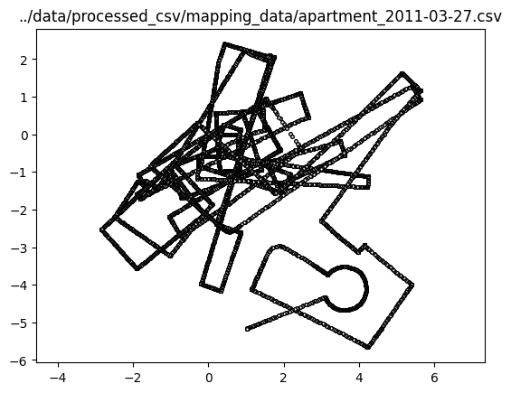
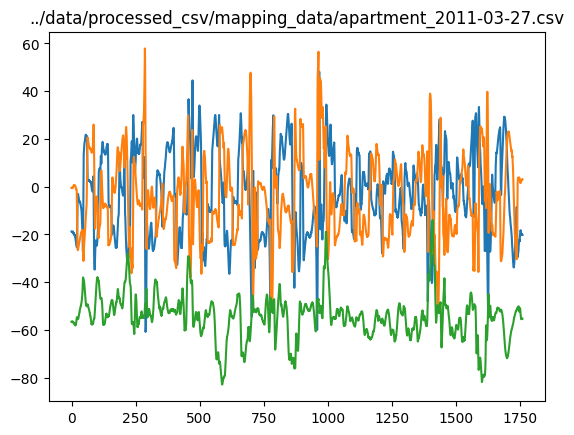
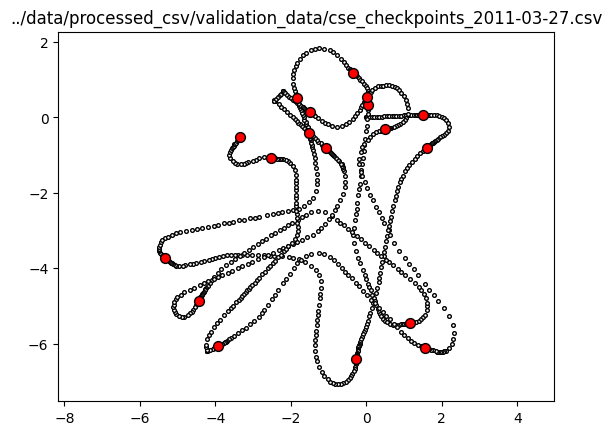

Magnetic field data for SLAM
============================
This repository contains magnetic field (MF) data collected in 2010-2011 with iRobot Create and MicroMag 3-axis magnetometer to perform MF-based SLAM. The data is used in experiments in my PhD research and the related MF SLAM papers 
(e.g. [here](https://oulurepo.oulu.fi/handle/10024/36321), [here](http://ieeexplore.ieee.org/abstract/document/6088632/),
and [here](http://ieeexplore.ieee.org/abstract/document/6766512/)), and published for reproducibility.

SLAM trajectories          |  Corresponding magnetometer readings | Validation data (loop closures)
:-------------------------:|:-------------------------:|:-------------------------:
  |   | 

## Contents
### Processed csv files `data/converted_csv`
* Original data converted to csv format easily readable by modern tools, such as Pandas.
  * Conversion script in `notebooks/process_raw_data.ipynb`
* Named columns and only relevant fields left:
  * `t` - relative (zero-based) time in seconds
  * `x`, `y` - spatial coordinates in meters
  * `theta` - heading in radians
  * `mx`, `my`, `mz` - magnetometer readings in uT
  * `spacebar` - manual keyboard press (for validation data)
* Different MF scaling factors corrected from the original data
* Only minor median filtering performed to remove MF outliers
* Should be easy to downsample as needed using Pandas, for example

### Original txt files `data/original_txt`
* Raw mapping data (used to produce SLAM data by downsampling and filtering)
* Validation data (used to evaluate localization performance afterwards)
* Calibration data (used to find out the magnetometer bias)

### Original downsampled `data/original_downsampled`
* Matlab script to visualize the raw data and produce SLAM data
* Downsampled 2Hz data for selected data sets (contains produced robot control and MF readings)

## Format for original data fields
Column numbering starting from 1 (for included MATLAB script).
### Raw mapping and validation data (original format)
* Odometry x and y, mm (1-2)
* Odometry heading, angles (4)
* Odometry distance, mm (5)
* Magnetometer data, uT scaled by 32 (or 8), and y and z multiplied by -1 (6-8)
* Space bar press indicator (18)
* Time stamp (19)
### Processed 2Hz SLAM control data (updated to CSV)
* Forward translation, m (1)
* Heading change, radians (2)
* Magnetic data, uT (3-5)
* Time stamp, s (6)